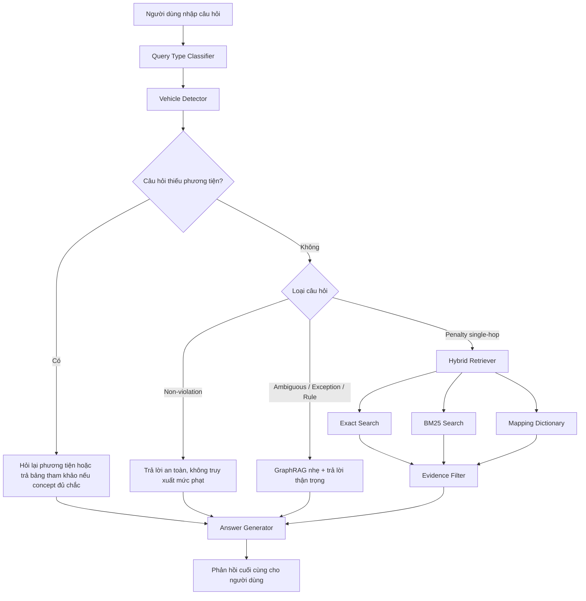
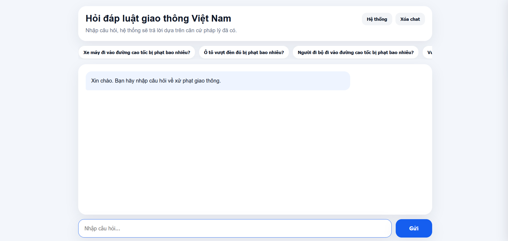
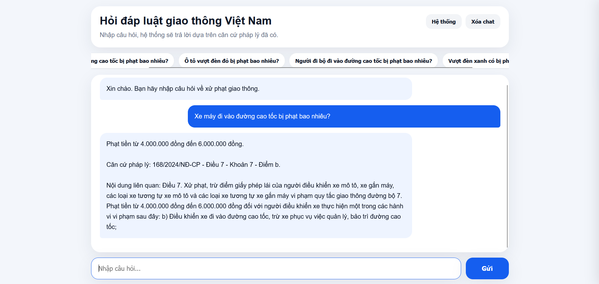

# 🚦 Traffic Law RAG — Vietnamese Traffic Penalty Q&A

<p align="center">
  
  
  
  
  
  
  
</p>

<p align="center">
  <b>Legal-safe RAG system for Vietnamese traffic penalty Q&A based on Nghị định 168/2024/NĐ-CP.</b>
</p>

<p align="center">
  <a href="https://github.com/franceto">GitHub: franceto</a> · Made with ❤️ by Franceto (ANH PHAP TO)
</p>

---

## 📌 Giới thiệu bài toán

**Traffic Law RAG** là hệ thống hỏi đáp luật giao thông Việt Nam theo hướng **Retrieval-Augmented Generation (RAG)**.

Mục tiêu của project là giúp người dùng nhập câu hỏi đời thường như:

> “Xe máy đi vào đường cao tốc bị phạt bao nhiêu?”  
> “Vượt đèn xanh có bị phạt không?”  
> “Người đi bộ đi vào đường cao tốc bị phạt bao nhiêu?”

Hệ thống sẽ:

- phân tích câu hỏi đầu vào,
- nhận diện loại phương tiện,
- chuyển câu hỏi đời thường sang hướng truy xuất pháp lý,
- tìm điều/khoản/điểm phù hợp,
- trả lời bằng ngôn ngữ dễ hiểu,
- kèm căn cứ pháp lý khi có dữ liệu phù hợp. 

Điểm quan trọng của project là **ưu tiên an toàn pháp lý**:

- Không tự bịa mức phạt.
- Không tự chọn phương tiện khi câu hỏi thiếu thông tin.
- Không chốt phạt cứng với tình huống mơ hồ hoặc ngoại lệ.
- Không kéo sai căn cứ, ví dụ không lấy lỗi đèn đỏ/vàng để trả lời câu hỏi “vượt đèn xanh”.

---

## 🧠 Công nghệ sử dụng

<p align="center">
  
  
  
  
  
  
</p>

| Nhóm | Công nghệ | Vai trò |
|---|---|---|
| Backend | FastAPI | Cung cấp web API `/api/ask` cho giao diện |
| Frontend | HTML, CSS, JavaScript | Giao diện web chat đơn giản, không dùng Streamlit |
| Core language | Python | Xử lý RAG pipeline |
| Retrieval | Exact Search, BM25 | Truy xuất chunk pháp lý liên quan |
| Safety filter | Evidence Filter | Lọc kết quả sai phương tiện/sai concept |
| Query understanding | Query Type Classifier | Phân loại câu hỏi: mức phạt, quy định, ngoại lệ, mơ hồ, không vi phạm |
| Vehicle understanding | Vehicle Detector | Nhận diện ô tô, xe máy, xe đạp, người đi bộ, xe máy chuyên dùng |
| Graph reasoning | GraphRAG nhẹ | Hỗ trợ câu hỏi luật/quy tắc/tình huống mơ hồ |
| Benchmark/Audit | Pandas + Python scripts | Chạy bộ 100 câu test và audit lỗi pháp lý nguy hiểm |

> Ghi chú: Dense Retrieval / Vector Database / Embedding hiện **chưa bật trong baseline hiện tại**. Trước đó project từng thử ChromaDB nhưng gặp vấn đề lệch dimension embedding, nên bản hiện tại ưu tiên **BM25 + Exact Search + Mapping Dictionary + Evidence Filter** để ổn định trước.

---

## 📚 Data sử dụng

Nguồn dữ liệu chính:

| Thành phần | Đường dẫn |
|---|---|
| Văn bản gốc | `data/raw/nghi_dinh_168_2024_chinhphu.html` |
| Text đã xử lý | `data/processed/nghi_dinh_168_2024_chinhphu.txt` |
| Chunk pháp lý | `data/chunks/legal_chunks.jsonl` |
| BM25 index | `data/indexes/bm25_index.pkl` |
| Mapping dictionary | `data/indexes/mapping_dictionary.json` |
| Legal graph | `data/indexes/legal_graph.json` |

Dữ liệu hiện tập trung vào:

> **Nghị định 168/2024/NĐ-CP** — quy định xử phạt vi phạm hành chính về trật tự, an toàn giao thông đường bộ.

---

## 🧹 Tiền xử lý dữ liệu

Pipeline tiền xử lý dữ liệu pháp lý gồm:

1. **Thu thập văn bản**
   - Lưu văn bản pháp lý dạng HTML/PDF vào `data/raw/`.

2. **Trích xuất text**
   - Làm sạch HTML.
   - Chuẩn hóa khoảng trắng.
   - Giữ lại cấu trúc điều/khoản/điểm.

3. **Tách chunk pháp lý**
   - Mỗi chunk cố gắng bám theo một đơn vị pháp lý:
     - Điều
     - Khoản
     - Điểm
     - Mức phạt
     - Nhóm phương tiện

4. **Gắn metadata**
   - `article`
   - `clause`
   - `point`
   - `citation`
   - `vehicle_group`
   - `fine_text`
   - `content`

5. **Build index**
   - Tạo BM25 index.
   - Tạo mapping dictionary.
   - Tạo legal graph nhẹ theo concept.

---

## 🔁 Pipeline từ câu hỏi đầu vào đến phản hồi



---

## 🧩 Các loại câu hỏi hệ thống đang xử lý

| Query type | Ý nghĩa | Cách xử lý |
|---|---|---|
| `penalty_single_hop` | Hỏi mức phạt trực tiếp | Truy xuất điều/khoản/điểm và trả mức phạt |
| `rule_question` | Hỏi quy định chung | Dùng GraphRAG nhẹ, trả lời thận trọng |
| `exception_question` | Hỏi ngoại lệ/miễn trừ | Không chốt cứng nếu thiếu căn cứ |
| `ambiguous_scenario` | Tình huống mơ hồ | Yêu cầu thêm tình tiết |
| `non_violation_question` | Câu hỏi không phải hành vi vi phạm rõ ràng | Không tự kéo mức phạt |
| `general_question` | Câu hỏi chung | Xử lý theo mức độ chắc chắn của retrieval |

---

## 🛡️ Các lớp an toàn pháp lý

| Rule | Mục tiêu |
|---|---|
| Không tự bịa mức phạt | Tránh hallucination |
| Không tự chọn phương tiện nếu câu hỏi thiếu | Tránh kéo sai Điều 6/7/8/9/10 |
| Không chốt phạt với tình huống mơ hồ | Tránh tư vấn sai |
| Không phạt câu “vượt đèn xanh” | Tránh kéo nhầm đèn đỏ/vàng |
| Evidence Filter | Loại nguồn sai phương tiện hoặc sai concept |
| Audit script | Kiểm tra lỗi nguy hiểm sau benchmark |

---

## 🧪 Benchmark nội bộ

Project có bộ test nội bộ 100 câu hỏi đời thường:

```bash
python scripts/10_run_user_100.py
python scripts/14_audit_results.py
```

Trạng thái baseline hiện tại:

| Chỉ số | Kết quả |
|---|---:|
| `NO_RETRIEVAL_TRUE` | 0 |
| `SUSPECT` | 0 |
| `AUDIT_FAIL` | 0 |

> Lưu ý: bộ 100 câu này là benchmark nội bộ để kiểm thử regression, không phải benchmark tuyệt đối cho toàn bộ luật giao thông.

---

## 🖼️ Demo chương trình

> Gợi ý lưu ảnh demo trong thư mục: `docs/images/`

### 1. Toàn bộ giao diện



### 2. Đoạn chat hỏi đáp



### 3. Drawer thông tin hệ thống


> Gợi ý ảnh thứ ba nên là `system_drawer.png`, chụp phần sidebar/drawer bên phải hiển thị tài liệu, retrieval method, backend, UI và trạng thái Dense Retrieval/Vector DB.

---

## 📁 Cấu trúc project

```text
traffic_law_rag/
├── app/
│   └── server.py
│
├── assets/
│   ├── index.html
│   ├── style.css
│   └── app.js
│
├── data/
│   ├── raw/
│   │   └── nghi_dinh_168_2024_chinhphu.html
│   ├── processed/
│   │   └── nghi_dinh_168_2024_chinhphu.txt
│   ├── chunks/
│   │   └── legal_chunks.jsonl
│   └── indexes/
│       ├── bm25_index.pkl
│       ├── mapping_dictionary.json
│       └── legal_graph.json
│
├── logs/
│   ├── user_100_results.csv
│   ├── user_100_audit_fail.csv
│   └── user_100_clarification.csv
│
├── scripts/
│   ├── 10_run_user_100.py
│   ├── 14_audit_results.py
│   └── 15_test_multi_vehicle.py
│
├── src/
│   ├── config/
│   │   └── settings.py
│   ├── ingestion/
│   ├── retrieval/
│   │   ├── bm25_search.py
│   │   ├── exact_search.py
│   │   └── hybrid_retriever.py
│   ├── rewrite/
│   │   ├── query_rewriter.py
│   │   ├── query_type_classifier.py
│   │   └── vehicle_detector.py
│   ├── graph/
│   │   ├── legal_graph_builder.py
│   │   └── graph_retriever.py
│   ├── llm/
│   │   ├── answer_generator.py
│   │   └── graph_answer_generator.py
│   └── rag/
│       ├── pipeline.py
│       └── multi_vehicle_answer.py
│
├── tests/
│   └── user_100_raw.txt
│
├── requirements.txt
└── README.md
```

---

## ⚙️ Cài đặt

### 1. Clone project

```bash
git clone https://github.com/franceto/traffic_law_rag.git
cd traffic_law_rag
```

### 2. Tạo môi trường ảo

#### Windows PowerShell

```powershell
python -m venv .venv
.\.venv\Scripts\Activate.ps1
```

#### macOS / Linux

```bash
python3 -m venv .venv
source .venv/bin/activate
```

### 3. Cài thư viện

```bash
pip install -r requirements.txt
```

Nếu chưa có `requirements.txt`, có thể tạo nhanh bằng:

```bash
pip freeze > requirements.txt
```

Các thư viện chính thường cần:

```text
fastapi
uvicorn
pandas
rank-bm25
python-dotenv
pydantic
```

---

## 🚀 Chạy web demo

```bash
uvicorn app.server:app --reload --host 127.0.0.1 --port 8000
```

Mở trình duyệt:

```text
http://127.0.0.1:8000
```

---

## 🧪 Chạy benchmark/audit

```bash
python scripts/10_run_user_100.py
python scripts/14_audit_results.py
```

Kết quả sẽ được lưu trong:

```text
logs/user_100_results.csv
logs/user_100_audit_fail.csv
logs/user_100_clarification.csv
```

---

## 🧭 Roadmap

- [x] RAG pipeline với Exact Search + BM25.
- [x] Vehicle detection.
- [x] Query type classification.
- [x] Evidence filter chống sai phương tiện.
- [x] GraphRAG nhẹ cho câu hỏi mơ hồ/quy định/ngoại lệ.
- [x] FastAPI web demo.
- [x] HTML/CSS/JS UI thay Streamlit.
- [ ] Mở rộng thêm nguồn luật chính thống ngoài Nghị định 168/2024/NĐ-CP.
- [ ] Thiết kế lại Dense Retrieval / Vector DB với embedding dimension thống nhất.
- [ ] Thêm reranker.
- [ ] Thêm export hội thoại.
- [ ] Thêm citation viewer chi tiết.

---

## 👥 Authors

**franceto (ANH PHAP TO)**  
GitHub: [https://github.com/franceto](https://github.com/franceto)

---

## ⭐ Support

Nếu project hữu ích, hãy cho một sao nhé! ⭐

Made with ❤️ by **Franceto (ANH PHAP TO)**
