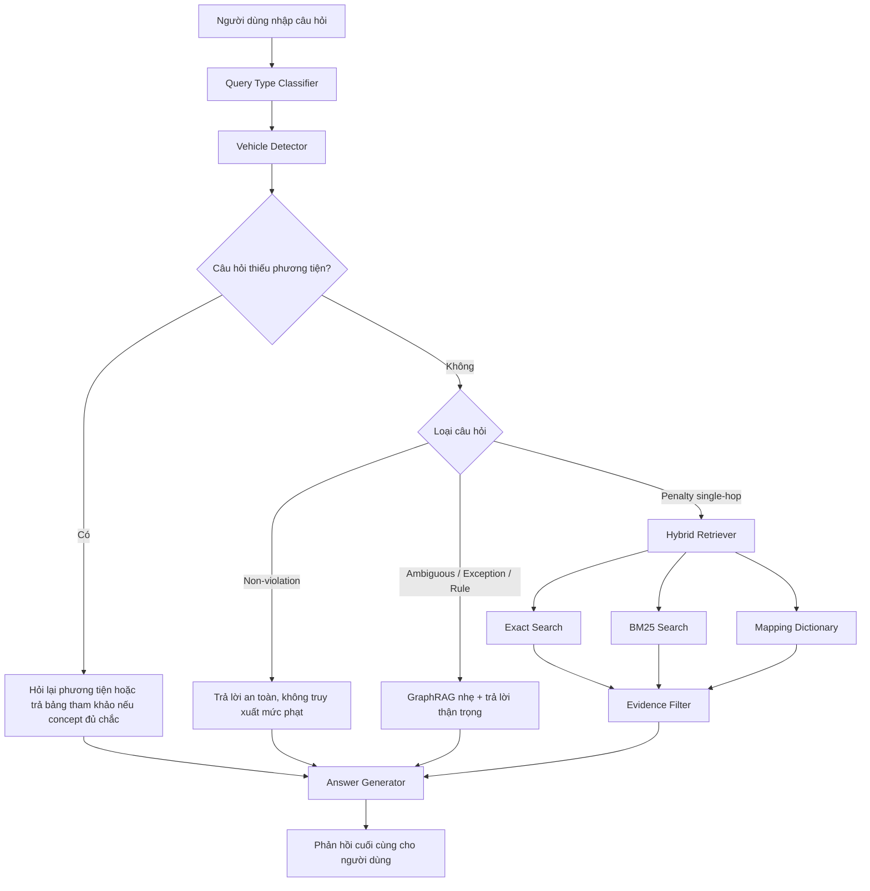

# Traffic Law RAG - Vietnamese Traffic Penalty Q&A

<div align="center">

<!-- Banner / Screenshot placeholder -->


<br/>

**Hệ thống hỏi đáp xử phạt giao thông Việt Nam dựa trên RAG, ưu tiên an toàn pháp lý và căn cứ từ Nghị định 168/2024/NĐ-CP.**

<br/>


</div>

---

## 1. Project Title & Catchphrase

**Traffic Law RAG** là hệ thống hỏi đáp luật giao thông Việt Nam theo hướng **Retrieval-Augmented Generation**.

Dự án giúp người dùng đặt câu hỏi đời thường về xử phạt giao thông và nhận câu trả lời dễ hiểu, có căn cứ pháp lý khi dữ liệu truy xuất đủ phù hợp.

Ví dụ câu hỏi:

```text
Xe máy đi vào đường cao tốc bị phạt bao nhiêu?
Vượt đèn xanh có bị phạt không?
Người đi bộ đi vào đường cao tốc bị phạt bao nhiêu?
```

Mục tiêu chính của project là **ưu tiên an toàn pháp lý**:

- Không tự bịa mức phạt.
- Không tự chọn phương tiện khi câu hỏi thiếu thông tin.
- Không chốt phạt cứng với tình huống mơ hồ hoặc ngoại lệ.
- Không kéo sai căn cứ, ví dụ không lấy lỗi đèn đỏ/vàng để trả lời câu hỏi về “vượt đèn xanh”.

---

## 2. Quick Demo & Visuals

<div align="center">

[Local Web Demo](http://127.0.0.1:8000) ·
[Source Code](https://github.com/franceto/traffic_law_rag)

<br/><br/>


<br/><br/>

<br/><br/>


</div>

> Web demo chạy tại `http://127.0.0.1:8000` sau khi khởi động server bằng Uvicorn.

---

## 3. Tính Năng Nổi Bật

- **Hỏi đáp xử phạt giao thông:** hỗ trợ câu hỏi đời thường về mức phạt, quy định, ngoại lệ và tình huống mơ hồ.
- **Nhận diện phương tiện:** phát hiện nhóm phương tiện như ô tô, xe máy, xe đạp, người đi bộ, xe máy chuyên dùng.
- **Truy xuất kết hợp:** dùng Exact Search, BM25 và Mapping Dictionary để tìm căn cứ pháp lý liên quan.
- **Lớp lọc bằng chứng:** loại bỏ kết quả sai phương tiện, sai hành vi hoặc sai concept pháp lý.
- **GraphRAG nhẹ:** hỗ trợ câu hỏi quy định, ngoại lệ hoặc tình huống cần suy luận theo quan hệ pháp lý.

---

## 4. Công Nghệ Sử Dụng

<div align="center">


</div>

### Thành phần kỹ thuật

| Nhóm | Công nghệ | Vai trò |
|---|---|---|
| Backend | FastAPI | Cung cấp web API `/api/ask` cho giao diện |
| Frontend | HTML, CSS, JavaScript | Giao diện web chat đơn giản, không dùng Streamlit |
| Core language | Python | Xử lý pipeline RAG |
| Retrieval | Exact Search, BM25 | Truy xuất chunk pháp lý liên quan |
| Safety filter | Evidence Filter | Lọc kết quả sai phương tiện hoặc sai concept |
| Query understanding | Query Type Classifier | Phân loại câu hỏi theo mục đích truy vấn |
| Vehicle understanding | Vehicle Detector | Nhận diện nhóm phương tiện trong câu hỏi |
| Graph reasoning | GraphRAG nhẹ | Hỗ trợ câu hỏi luật, quy tắc, ngoại lệ và tình huống mơ hồ |
| Benchmark/Audit | Pandas, Python scripts | Chạy bộ 100 câu test và audit lỗi pháp lý nguy hiểm |

> Dense Retrieval, Vector Database và Embedding hiện chưa bật trong baseline hiện tại. Project từng thử ChromaDB nhưng gặp vấn đề lệch dimension embedding, nên bản hiện tại ưu tiên BM25, Exact Search, Mapping Dictionary và Evidence Filter để ổn định trước.

---

## 5. Triển Khai Nhanh

**Prerequisites**

- Python 3.11+
- Git
- Môi trường ảo Python
- File dữ liệu/index đã được chuẩn bị trong thư mục `data/`

```bash
# Clone repository
git clone https://github.com/franceto/traffic_law_rag.git
cd traffic_law_rag

# Tạo và kích hoạt môi trường ảo trên Windows PowerShell
python -m venv .venv
.\.venv\Scripts\Activate.ps1

# Cài thư viện phụ thuộc
pip install -r requirements.txt

# Khởi chạy web demo
uvicorn app.server:app --reload --host 127.0.0.1 --port 8000

# Chạy benchmark nội bộ 100 câu
python scripts/10_run_user_100.py

# Audit kết quả benchmark
python scripts/14_audit_results.py
```

Mở trình duyệt:

```text
http://127.0.0.1:8000
```

Nếu chưa có `requirements.txt`, có thể tạo từ môi trường hiện tại bằng:

```bash
pip freeze > requirements.txt
```

Các thư viện chính thường cần:

```text
fastapi
uvicorn
pandas
rank-bm25
python-dotenv
pydantic
```

---

## 6. Tài Liệu Dự Án

### Data sử dụng

Nguồn dữ liệu chính tập trung vào **Nghị định 168/2024/NĐ-CP**, quy định xử phạt vi phạm hành chính về trật tự, an toàn giao thông đường bộ.

| Thành phần | Đường dẫn |
|---|---|
| Văn bản gốc | `data/raw/nghi_dinh_168_2024_chinhphu.html` |
| Text đã xử lý | `data/processed/nghi_dinh_168_2024_chinhphu.txt` |
| Chunk pháp lý | `data/chunks/legal_chunks.jsonl` |
| BM25 index | `data/indexes/bm25_index.pkl` |
| Mapping dictionary | `data/indexes/mapping_dictionary.json` |
| Legal graph | `data/indexes/legal_graph.json` |

### Pipeline tiền xử lý dữ liệu

| Bước | Mục tiêu |
|---|---|
| Thu thập văn bản | Lưu văn bản pháp lý dạng HTML/PDF vào `data/raw/` |
| Trích xuất text | Làm sạch HTML, chuẩn hóa khoảng trắng, giữ cấu trúc điều/khoản/điểm |
| Tách chunk pháp lý | Chia theo điều, khoản, điểm, mức phạt, nhóm phương tiện |
| Gắn metadata | Lưu `article`, `clause`, `point`, `citation`, `vehicle_group`, `fine_text`, `content` |
| Build index | Tạo BM25 index, mapping dictionary và legal graph nhẹ |

### Pipeline từ câu hỏi đến phản hồi



### Các loại câu hỏi đang xử lý

| Query type | Ý nghĩa | Cách xử lý |
|---|---|---|
| `penalty_single_hop` | Hỏi mức phạt trực tiếp | Truy xuất điều/khoản/điểm và trả mức phạt |
| `rule_question` | Hỏi quy định chung | Dùng GraphRAG nhẹ, trả lời thận trọng |
| `exception_question` | Hỏi ngoại lệ hoặc miễn trừ | Không chốt cứng nếu thiếu căn cứ |
| `ambiguous_scenario` | Tình huống mơ hồ | Yêu cầu thêm tình tiết |
| `non_violation_question` | Câu hỏi không phải hành vi vi phạm rõ ràng | Không tự kéo mức phạt |
| `general_question` | Câu hỏi chung | Xử lý theo mức độ chắc chắn của retrieval |

### Các lớp an toàn pháp lý

| Rule | Mục tiêu |
|---|---|
| Không tự bịa mức phạt | Tránh hallucination |
| Không tự chọn phương tiện nếu câu hỏi thiếu | Tránh kéo sai điều theo nhóm phương tiện |
| Không chốt phạt với tình huống mơ hồ | Tránh tư vấn sai |
| Không phạt câu hỏi về “vượt đèn xanh” | Tránh kéo nhầm lỗi đèn đỏ hoặc đèn vàng |
| Evidence Filter | Loại nguồn sai phương tiện hoặc sai concept |
| Audit script | Kiểm tra lỗi nguy hiểm sau benchmark |

### Benchmark nội bộ

Project có bộ test nội bộ 100 câu hỏi đời thường:

```bash
python scripts/10_run_user_100.py
python scripts/14_audit_results.py
```

Trạng thái baseline hiện tại:

| Chỉ số | Kết quả |
|---|---:|
| `NO_RETRIEVAL_TRUE` | 0 |
| `SUSPECT` | 0 |
| `AUDIT_FAIL` | 0 |

> Bộ 100 câu này dùng để kiểm thử regression nội bộ, không phải benchmark tuyệt đối cho toàn bộ luật giao thông.

### Project Structure

```text
traffic_law_rag/
├── app/
│   └── server.py
├── assets/
│   ├── index.html
│   ├── style.css
│   └── app.js
├── data/
│   ├── raw/
│   │   └── nghi_dinh_168_2024_chinhphu.html
│   ├── processed/
│   │   └── nghi_dinh_168_2024_chinhphu.txt
│   ├── chunks/
│   │   └── legal_chunks.jsonl
│   └── indexes/
│       ├── bm25_index.pkl
│       ├── mapping_dictionary.json
│       └── legal_graph.json
├── docs/
│   └── images/
│       ├── gui.png
│       ├── chat.png
│       └── system_drawer.png
├── logs/
│   ├── user_100_results.csv
│   ├── user_100_audit_fail.csv
│   └── user_100_clarification.csv
├── scripts/
│   ├── 10_run_user_100.py
│   ├── 14_audit_results.py
│   └── 15_test_multi_vehicle.py
├── src/
│   ├── config/
│   │   └── settings.py
│   ├── ingestion/
│   ├── retrieval/
│   │   ├── bm25_search.py
│   │   ├── exact_search.py
│   │   └── hybrid_retriever.py
│   ├── rewrite/
│   │   ├── query_rewriter.py
│   │   ├── query_type_classifier.py
│   │   └── vehicle_detector.py
│   ├── graph/
│   │   ├── legal_graph_builder.py
│   │   └── graph_retriever.py
│   ├── llm/
│   │   ├── answer_generator.py
│   │   └── graph_answer_generator.py
│   └── rag/
│       ├── pipeline.py
│       └── multi_vehicle_answer.py
├── tests/
│   └── user_100_raw.txt
├── requirements.txt
└── README.md
```

### Roadmap

- [x] RAG pipeline với Exact Search và BM25.
- [x] Vehicle detection.
- [x] Query type classification.
- [x] Evidence filter chống sai phương tiện.
- [x] GraphRAG nhẹ cho câu hỏi mơ hồ, quy định và ngoại lệ.
- [x] FastAPI web demo.
- [x] HTML/CSS/JS UI thay Streamlit.
- [ ] Mở rộng thêm nguồn luật chính thống ngoài Nghị định 168/2024/NĐ-CP.
- [ ] Thiết kế lại Dense Retrieval / Vector DB với embedding dimension thống nhất.
- [ ] Thêm reranker.
- [ ] Thêm export hội thoại.
- [ ] Thêm citation viewer chi tiết.

### Author

**franceto (ANH PHAP TO)**  
GitHub: [https://github.com/franceto](https://github.com/franceto)

### Support

Nếu project hữu ích, hãy cho repository một sao.

Made by **Franceto (ANH PHAP TO)**
